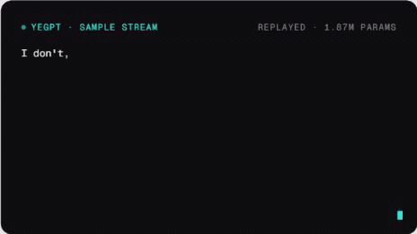

<div align="center">

# yeGPT

**A 1.87M-parameter character-level GPT built directly in PyTorch and trained on a 0.67MB corpus.**

[](https://github.com/mreinhofferxd-pixel/yegpt/actions/workflows/ci.yml)
[](MODEL_CARD.md)
[](https://www.python.org/)
[](LICENSE)

[Quick start](#quick-start) · [Results](#what-the-runs-showed) · [SPEC](SPEC.md) · [Model card](MODEL_CARD.md)

</div>

<p align="center">
  
</p>

<p align="center"><em>Actual run3 output, profanity-filtered and replayed for presentation. Nothing runs live in this README.</em></p>

## The result

| Model | Data | Best validation loss | Hardware |
| --- | --- | ---: | --- |
| **1.87M parameters** | 0.67MB deduplicated text | **1.577** | One RTX 4080 |

At this scale, the model produces word-shaped, line-shaped, recognizably Kanye-styled gibberish. It learns cadence, punctuation, slang, and local structure, but not coherent meaning.

That ceiling is the result, not something this README hides. Scaling the same corpus from 1.87M to 10.92M parameters drove training loss from `1.14` to `0.08` while validation loss got worse. The larger models memorized harder; they did not understand more.

## What this is

yeGPT is a decoder-only transformer implemented directly with PyTorch tensors, autograd, and optimizers:

- Character tokenizer and dataset pipeline.
- Causal multi-head self-attention.
- Learned positional embeddings.
- Pre-norm residual transformer blocks.
- Training, evaluation, checkpointing, and sampling.
- A CLI plus release-safe checkpoint export.
- Corpus deduplication so validation loss measures generalization rather than leaked verses.

There is no `nn.Transformer`, `nn.MultiheadAttention`, Hugging Face model class, pretrained model, or transformer helper library. The model-shaped code lives in [`src/yegpt/model.py`](src/yegpt/model.py).

```text
raw text
   │
   ▼
normalize + deduplicate ─> character tokenizer ─> train/validation split
                                                   │
                                                   ▼
                                      decoder-only transformer
                                                   │
                                      ┌────────────┴────────────┐
                                      ▼                         ▼
                              best-val checkpoint         final checkpoint
                                      │
                                      ▼
                         temperature / top-p / repetition penalty
                                      │
                                      ▼
                               CLI + sample replay
```

## Quick start

Requires Python 3.11 or 3.12. Sampling works on CPU; CUDA is only needed for training.

```bash
python -m venv .venv
python -m pip install -e ".[dev]"
```

Download the released fp16 checkpoint and generate from a prompt:

```bash
gh release download v0.1.0 --pattern "yegpt-small-fp16.pt"
yegpt "I'm the greatest" --checkpoint yegpt-small-fp16.pt
```

The installed `yegpt` command has two modes:

```bash
# Prompt mode
yegpt "I'm the greatest" --max-chars 200 --seed 1337

# Pipeline commands
yegpt data-prep | tweet-prep | dedup | train | sample | export | export-samples
yegpt sample --help
```

## What the runs showed

### Training sweep

Three runs used the same deduplicated 0.67MB corpus, 5,000-step budget, batch size 64, learning rate `3e-4`, and context length 256.

| Run | Width | Dropout | Parameters | Final train | Final val | Best val |
| --- | ---: | ---: | ---: | ---: | ---: | ---: |
| run1 | 256 | 0.2 | 3.28M | 0.89 | 1.68 | 1.59 at step 2500 |
| run2 | 256 | 0.3 | 3.28M | 1.15 | 1.60 | 1.59 at step 3750 |
| **run3** | **192** | **0.2** | **1.87M** | **1.14** | **1.59** | **1.577 at step 4250** |

run3 became the settled configuration: the lowest validation loss, the least compute, and no late validation divergence.

### Scale and context ablation

The follow-up sweep held the data and training budget fixed while increasing model size by 5.8× and context length by 2×.

| Run | Parameters | Context | Best val | Final train / val | Throughput | Peak VRAM |
| --- | ---: | ---: | ---: | ---: | ---: | ---: |
| **baseline** | **1.87M** | 256 | 1.577 | 1.14 / 1.59 | 553k tok/s | 1.28 GiB |
| mid | 5.08M | 256 | 1.599 | 0.60 / 1.84 | 288k tok/s | 2.76 GiB |
| large | 10.82M | 256 | 1.582 | 0.23 / 2.32 | 218k tok/s | 3.84 GiB |
| long-context | 10.92M | 512 | 1.563 | 0.08 / 2.86 | 133k tok/s | 9.45 GiB |

Best validation loss stayed between `1.563` and `1.599`. Coherence did not improve. Capacity bought memorization, and doubling context turned a 2.5-minute run into a 20.5-minute run without moving the generalization floor.

## Reproduce the pipeline

Put source files in `data/raw/`; that directory and the derived corpus are intentionally gitignored.

```bash
# Normalize and combine the source files
python -m yegpt.data_prep

# Remove cross-file duplicate verses before the split
python -m yegpt.dedup

# Train the settled 1.87M-parameter configuration
python -m yegpt.train \
  --n-embd 192 \
  --block-size 256 \
  --dropout 0.2 \
  --max-iters 5000 \
  --eval-interval 250 \
  --out-dir checkpoints/run3

# Sample the trained checkpoint
python -m yegpt.sample \
  --checkpoint checkpoints/run3/yegpt-ckpt.pt \
  --prompt "" \
  --num-tokens 500 \
  --seed 1337 \
  --temperature 0.9 \
  --top-p 0.92 \
  --repetition-penalty 1.3
```

Run `data_prep` before `dedup`. Re-running `data_prep` rebuilds the corpus from the raw files and therefore removes the previous deduplication pass.

Each training run saves both final weights and the lowest-validation snapshot. On a corpus this small, the best-validation checkpoint is often the useful one because final weights can continue memorizing after validation performance turns.

## What I learned

- **The data wall was real.** Adding parameters barely moved best validation loss but sharply increased overfitting.
- **Deduplication was part of evaluation.** The two source collections shared roughly 36% of their songs; leaving duplicates in would leak memorized text across the split.
- **Character tokenization made the mechanics visible.** A 104-character vocabulary avoids tokenizer machinery, but the model spends capacity learning spelling and word boundaries.
- **Sampling changes readability, not knowledge.** Temperature, nucleus sampling, and repetition penalties alter how a fixed checkpoint is read out. They do not make the weights more coherent.
- **The practical 4080 limit was time, not memory.** The long-context run used 9.45 GiB of 16 GiB but was four times slower than the baseline because attention cost grows with context length squared.

The detailed model design, experiment plan, and constraints are in [`SPEC.md`](SPEC.md). Release metadata and intended-use boundaries are in [`MODEL_CARD.md`](MODEL_CARD.md).

## Project map

```text
src/yegpt/    tokenizer, model, training, sampling, export, and CLI
tests/        unit, smoke, typing, and pipeline coverage
web/          dependency-free replay embed and generated sample JSON
scripts/      checkpoint and sample export helpers
data/raw/     local source text, gitignored
checkpoints/  local training output, gitignored
```

## License and data boundary

Source code is [MIT](LICENSE). The license covers the code only. It does not cover the training corpus, raw source text, or model weights. The corpus is not distributed with this repository; see [`MODEL_CARD.md`](MODEL_CARD.md).
